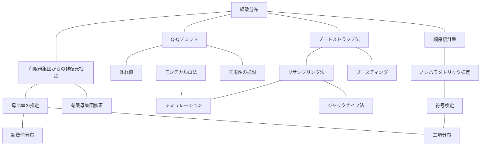
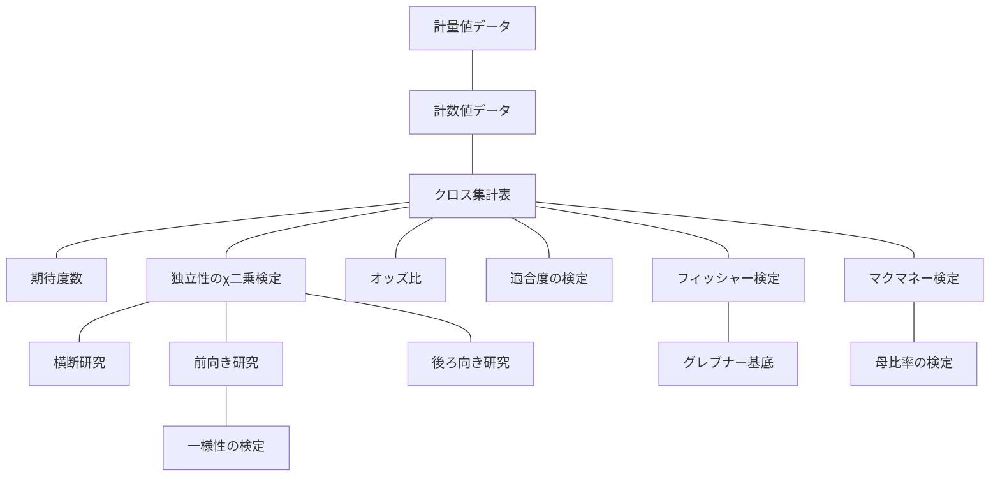

```mermaid
graph
経験分布 --- 順序統計量　
経験分布 --- ブートストラップ法
ブートストラップ法 --- ブースティング
ブートストラップ法 --- リサンプリング法
リサンプリング法 --- ジャックナイフ法
リサンプリング法 --- シミュレーション
モンテカルロ法 --- シミュレーション
経験分布 --- Q-Qプロット
Q-Qプロット --- 正規性の検討
Q-Qプロット --- 外れ値
順序統計量 --- ノンパラメトリック検定
経験分布 --- 有限母集団からの非復元抽出
有限母集団からの非復元抽出 --- 有限母集団修正
有限母集団からの非復元抽出 --- 母比率の推定
母比率の推定 --- 二項分布
母比率の推定 --- 超幾何分布
ノンパラメトリック検定 --- 符号検定
符号検定 --- 二項分布

```

```mermaid
graph

計量値データ --- 計数値データ
計数値データ --- クロス集計表
クロス集計表 --- 期待度数
クロス集計表 --- 独立性のχ二乗検定
独立性のχ二乗検定 --- 横断研究
独立性のχ二乗検定 --- 前向き研究
独立性のχ二乗検定 --- 後ろ向き研究
クロス集計表 --- オッズ比
クロス集計表 --- 適合度の検定
前向き研究 --- 一様性の検定
クロス集計表 --- フィッシャー検定
フィッシャー検定 --- グレブナー基底
クロス集計表 --- マクマネー検定
マクマネー検定 --- 母比率の検定
```